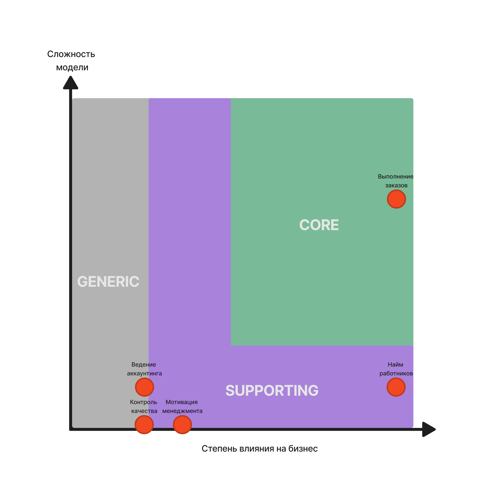

## Схемы
- [Figma (смотреть в ней наверняка будет удобнее)](https://www.figma.com/file/zeFPJA93FAmoOh0V0rUFVp/MCF)
- [Event Storming](ES.png)
- [Модель данных](DataModel.png)
- [Модель коммуникаций](CommunicationModel.png)

## Поддомены и боундед контексты

По сравнению с первым ДЗ добавилось два новых контекста - “Контроль качества” и “Мотивация менеджмента”. 
Изначальная идея вынести их отдельно была все же правильной, напрасно в первом ДЗ я объединил эти контексты с основным жизненным циклом заказа. Контроль качества и мотивация менеджмента решают совсем другие проблемы бизнеса, отличные от проблемы создания и ведения заказов.

Также общий аккаунтинг был разбит на аккаунтинг исполнителя и аккаунтинг клиента. Они решают разные задачи бизнеса и выполняют разные операции, хоть в обоих случаях речь и идет о финансах.

## Таблица характеристик системы

|Характеристика|Значение|Причины|
|---|---|---|
|Availability|Высокое|[US-081] - вероятность дудоса|
|Scalability & Elasticity|Среднее|- [US-081] - от 1к заявок в день; - компания планирует расширяться в будущем|
|Modifiability|Высокое|Для бизнеса критично проверять ... и изменять ... с максимальной скоростью и надёжностью.|
|Agility|Высокое|- Для бизнеса критично проверять ... и изменять ... с максимальной скоростью и надёжностью. - Бизнесу необходим низкий ТТМ|
|Testability|Высокое|- Для бизнеса критично проверять ... и изменять ... с максимальной скоростью и надёжностью. - Бизнесу необходим низкий ТТМ|
|Deployability|Высокое|- Для бизнеса критично проверять ... и изменять ... с максимальной скоростью и надёжностью. - Бизнесу необходим низкий ТТМ|
|Usability|Высокое|Система по большей части состоит из дашбордов. Клиентам должно быть удобно смотреть и создавать свои заказы, а также мониторить финансовую часть. Исполнители должны без проблем использовать систему для выполнения заказов. А менеджерам необходимо мониторить все процессы - от найма до контроля качества выполнения заказов.|

## Реализация системы
Исходя из характеристик системы и неограниченного бюджета прихожу к выводу, что оптимальным выбором будет **микросервисный стиль**.
Каждый боундед контекст выносится в сервис.

#### **1. Сервис найма Исполнителей.** 
Отвечает за обработку Заявок на тест Исполнителя. Реализует самую изменчивую часть системы, на него ожидается самая большая нагрузка и существует опасность DDoS-атак.
- Асинхронно отправляет CUD Исполнителя в остальные сервисы.

#### **2. Сервис Заказов.** 
Отвечает за создание Заказа, расчет его стоимости, смену статусов Заказа.
- Асинхронно отправляет CUD Заказа в остальные сервисы.
- Асинхронно обращается в Сервис подбора Исполнителей за получением Исполнителя (подбор может занимать много времени?).
- Синхронно обращается в Сервис склада Расходников за созданием заявки на получение Расходников.

#### **3. Сервис мотивации менеджмента.**
Реализует функционал ставок менеджеров на итоги Заказа.
- Не взаимодействует напрямую с остальными сервисами.

#### **4. Сервис подбора Исполнителя.** 
Реализует алгоритм подбора Исполнителя для конкретного Заказа. Вынесен в самостоятельный сервис, так как разработчики алгоритма ни в какую не желают изменить используемые ими именования сущностей и не раскрывают деталей алгоритма. Всем будет лучше, если этот функционал будет обособлен.
- Асинхронно выдает Сервису Заказов подходящего к Заказу исполнителя.

#### **5. Сервис склада Расходников.** 
Отвечает за обработку Запросов по сбору расходников для Заказа. Решает проблему комплектования исполнителей расходниками. Также содержит работающий с задержкой функционал - заказ fur-tune-печеньки индивидуально для каждого комплекта Расходников. Здесь требуется асинхронная коммуникация.
- Асинхронно сообщает остальным сервисам Заказов об успешном укомплектовании Заказа расходниками.

#### **6. Сервис Аккаунтинга клиентов.** 
Отвечает за еженедельные выставления счетов Клиентам. Так же реализует механизм расчета индивидуальной скидки Клиента, так как скидка зависит от затраченной суммы и пересчитывается после оплаты счета.
- Асинхронно сообщает остальным сервисам о перерасчете индивидуальной скидки Клиента (оплаты раз в неделю, можно не рассылать размер скидки синхронно).

#### **7. Сервис Аккаунтинга исполнителей.** 
Отвечает за ежемесячные выплаты Исполнителям и за выставление штрафов Исполнителям за проваленные заказы.
- Не взаимодействует напрямую с остальными сервисами.

#### **8. Сервис контроля качества.**
Реализует функционал ревью Заказов менеджерами с целью контроля качества выполнения.
- Не взаимодействует напрямую с остальными сервисами.

