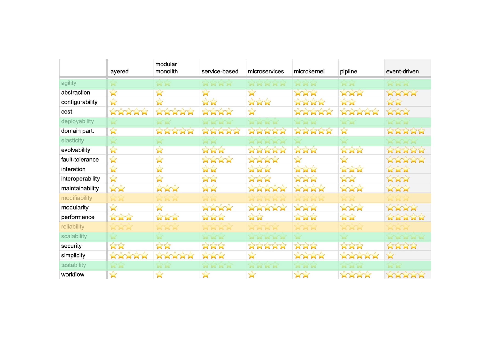

# Выбор архитектурного стиля для сервиса подбора исполнителя заказа

## Status: *Proposed*

## Context
Исходя из требований и консёрнов стейкхолдеров принято решение реализовать контекст подбора исполнителя заказа в виде самостоятельного сервиса.

Ниже приводится список характеристик и причин их возникновения.

- Ко всей системе применяются требования **Availability**, **Testability** и **Deployability**.
- Для контекста важно **Modifiability**, это характеристика из требований US-070 - "необходимо иметь возможность добавлять или редактировать шаги".
- Требования к **Scalability & Elasticity** взяты из консёрна менеджеров о многократно возросшем потоке заказов.
- Значение **Reliability** взято из консёрна клиентов о том, что система работы с заказом должна работать исправно. Сервис подбора исполнителя напрямую связан с сервисом ведения заказов.
- **Usability** также взято из требования US-070 - последовательность шагов можно менять. Это должно быть реализовано удобно, чтобы обеспечить наилучшее качествоподбора исполнителя.

Помимо характеристик, требование US-070 прямым текстом говорит, что алгоритм матчинга схож с map-reduce, и представляет собой последовательность шагов.

## Decision
Для сервиса подбора исполнителя заказа выбран архитектурный стиль Pipeline.

Основной критерий выбора - требование US-070, говорящее о схожести алгоритма с map-reduce и необходимости менять/добавлять шаги в алгоритм.

Общие требования к системе **Availability**, **Testability** и **Deployability** закрываются фактом реализации системы в виде микросервисов.

Основные требования к контексту **Modifiability**, **Scalability** и **Elasticity** закрываются фактом вынесения функционала подбора в самостоятельный сервис. Теперь алгоритм подбора можно дорабатывать и масштабировать без осложнений для остальной системы.

Характеристика **Reliability** у Pipeline-монолита удовлетворительная и достаточная.

Также из требований нельзя сделать вывод о расхождении характеристик разных шагов, поэтому дробить сервис дальше нет смысла. Pipeline-монолит решит задачу.
